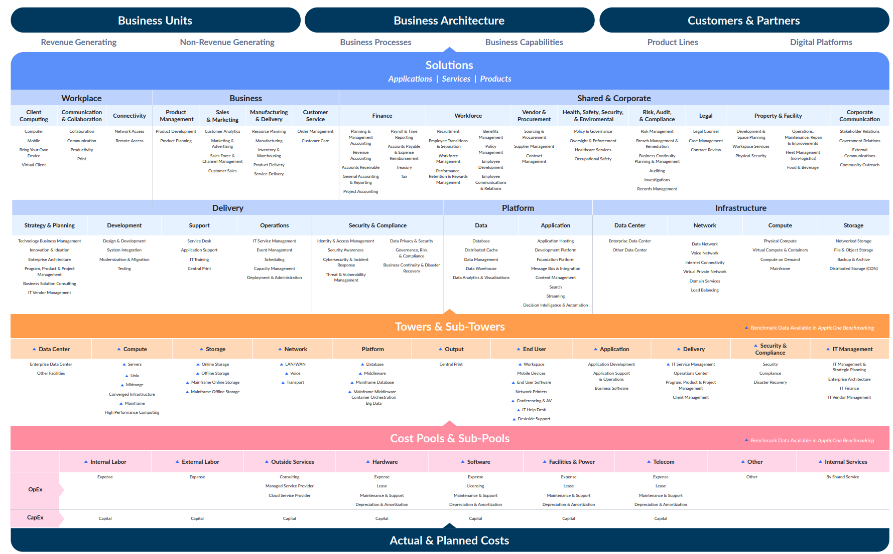

# Аналитическая лабораторная работа №1

## Состав команды:
- Гнеушев Владислав К3239 (капитан)
- Косенков Дмитрий К3239
- Захарчук Александр К3241

## Имеем:
1. Слепок данных биллинга от провайдера после небольшой обработки в виде SQL-параметров. Символ % в начале/конце означает, что перед/после него может стоять любой набор символов.
2. Google с документациями провайдера

## Ход работы:
1. Изучили структуру модели Apptio TBM Unified Model (ATUM) и вынесли для себя названия IT Towers с указанного в инструкции [сайта](https://www.apptio.com/platform/atum/), а также постер, который помог в категоризации.

 

2. Заполнили столбцы `IT Tower`, `Service Family`, `Service Type`, `Service Usage Type` в исходной таблице.

3. Далее мы подобрали российские аналоги указанных сервисов.

    1) Amazon ElastiCache – это бессерверный сервис от Amazon для кэширования данных, совместимый с Redis и Memcached. Сервис помогает ускорить получение данных, т.к. данные будут получаться из ОЗУ сервера, а не с диска, как происходит в обычных базах данных.
    
    > Аналог:  
    Yandex Managed Service for Redis - сервис, помогающий разворачивать и поддерживать кластеры серверов Redis в инфраструктуре Yandex Cloud.

    2) Amazon ElasticSearch - это сервис для развертывания, масштабирования и управления кластерами Elasticsearch в облаке. ElasticSearch - это легко масштабируемая система поисковых и аналитических инструментов с открытым исходным кодом, позволяющая быстро искать и анализировать данные.

    > Аналог:  
    Yandex Managed Service for OpenSearch - это сервис для развертывания, масштабирования и управления кластерами OpenSearch в облаке. Opensearch - аналог ElasticSearch. 
    Есть возможность переноса существующего кластера Elasticsearch в сервис от Yandex.

    3) Amazon QLDB - это NoSQL база данных реестров, обеспечивающая прозрачный, неизменяемый и проверяемый криптографическими методами журнал транзакций.

    > Аналог:  
    Не найден

    4) AWS Key Management Service - сервис, который позволяет создавать ключи для криптографических операций и контролировать их применение.

    > Аналог:  
    Yandex Key Management Service - сервис позволяет создавать ключи шифрования и управлять ими. Сами ключи применяются в защите данных в инфраструктуре Yandex Cloud, а также шифровании и расшифровке ваших данных.

    5) AWS CloudHSM - криптографический сервис, служащий для использования аппаратных модулей безопасности HWS (Hardware security module) в инфраструктуре AWS. Сервис позволяет создавать, управлять ключами шифрования, использовать их для защиты данных в инфрастуктуре AWS.

    > Аналог:  
    Yandex Key Management Service - сервис позволяет создавать ключи шифрования и управлять ими. Сами ключи применяются в защите данных в инфраструктуре Yandex Cloud, а также шифровании и расшифровке ваших данных.

    6) Amazon Rekognition - сервис, предоставляющий возможность использовать предобученные модели компьютерного зрения. При помощи него можно распознавать/анализировать лица, распознавать текст на изображениях, распознавать знаки/эмблемы/объекты на изображениях, сегментировать изображения на части.

    > Аналог:  
    Yandex Vision - сервис компьютерного зрения для анализа изображений. Сервис позволяет распознавать лица на изображениях, распознавать текст, модерировать изображения, классифицировать изображения.

    7) Amazon Textract – сервис машинного обучения (МО), который автоматически извлекает печатный и рукописный текст, элементы макета и данные из сканированных документов.

    > Аналог:  
    Yandex Vision OCR - сервис использующий компьютерное зрение для распознавания текста в документах, и их последующего анализа. Сервис поможет распознавать печатный и рукописный текст на изображении, распознавать таблицы, классифицировать изображения. 

    8) Amazon Lex — это сервис для создания диалоговых интерфейсов в приложениях с использованием голоса и текста.

    > Аналог:  
    Yandex SpeechKit - сервис который при помощи речевых технологий на базе машинного обучения помогает создавать голосовых помощников, а также автоматизировать колл-центры.

    9) AWS CodePipeline — это CD (continuous delivery) сервис, который дает возможность моделировать, визуализировать и автоматизировать деплой приложений.

    > Аналог:  
    Не найден

    10) Amazon SES – это облачный поставщик сервисов электронной почты, который может быть интегрирован в любое приложение для автоматизации работы с большими объемами почты. 

    > Аналог:  
    Yandex Cloud Postbox - сервис, позволяющий отправлять транзакционные email-сообщения. Например, письма о восстановлении пароля или доставке заказа.

    11) Amazon SNS - сервис, предлагающий обмен сообщениями/уведомлениями между сетевыми компонентами в инфраструктуре AWS и внешними сетевыми компонентами.

    > Аналог:  
    Yandex Message Queue - сервис обеспечивающий взаимодействия между приложениями и микросервисами используя для этого очереди сообщений.

 

| Сервис                     | Российский аналог                     |
| -------------------------- | ------------------------------------- |
| Amazon ElastiCache         | Yandex Managed Service for Redis      |
| Amazon Elasticsearch       | Yandex Managed Service for Opensearch |
| Amazon QLDB                | -                                     |
| AWS Key Management Service | Yandex Key Management Service         |
| AWS CloudHSM               | Yandex Key Management Service         |
| Amazon Rekognition         | Yandex Vision                         |
| Amazon Textract            | Yandex Vision OCR                     |
| Amazon Lex                 | Yandex SpeechKit                      |
| AWS CodePipeline           | -                                     |
| Amazon SES                 | Yandex Cloud Postbox                  |
| Amazon SNS                 | Yandex Message Queue                  |

## Вывод по возможности миграции
Можем сделать вывод, что возможна частичная миграция на российские сервисы с сервисов AWS. Мы не смогли найти аналогов для сервисов Amazon QLDB, AWS CodePipeline. Некоторые росссийские аналоги не предоставляют части функционала зарубежных сервисов (например, Yandex Vision не имеет отдельного функционала для распознания эмблем/логотипов, который имеет Amazon Rekognition), поэтому при миграции могут возникнуть неудобства/проблемы.