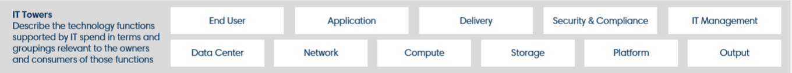
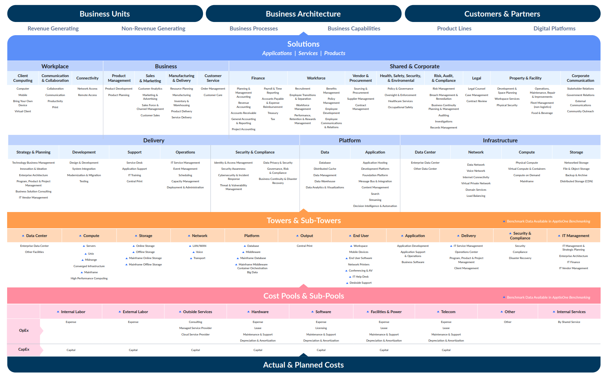
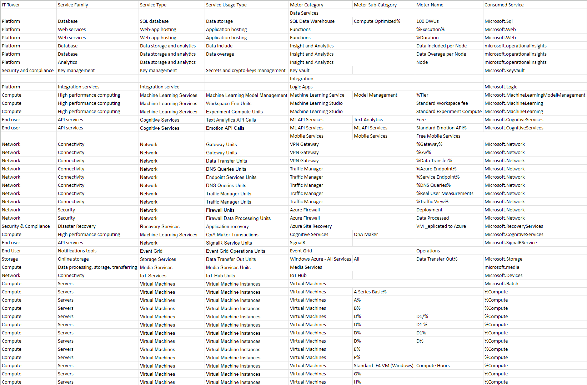

# Аналитическая лабораторная работа №2

## Состав команды:
- Гнеушев Владислав К3239 (капитан)
- Косенков Дмитрий К3239
- Захарчук Александр К3241

## Имеем:
1. Слепок данных биллинга от провайдера после небольшой обработки в виде SQL-параметров. Символ % в начале/конце означает, что перед/после него может стоять любой набор символов.
2. Google с документациями провайдера

## Ход работы:
1. Изучили структуру модели Apptio TBM Unified Model (ATUM) и вынесли для себя названия IT Towers с указанного в инструкции [сайта](https://www.apptio.com/platform/atum/), а также постер, который помог в категоризации.

 

2. Заполнили столбцы `IT Tower`, `Service Family`, `Service Type`, `Service Usage Type` в исходной таблице.

3. Далее мы подобрали российские аналоги указанных сервисов.

    1) Azure Web - сервис для создания, развертывания и администрирования веб-приложений. Имеет возможность автомасштабирования и балансировки нагрузки.

    > Аналог:  
    Yandex Compute Cloud - сервис, предоставляющий вычислительные мощности, его можно использовать для: размещения веб-проектов, тестирования и протипирования веб-проектов, высокопроизводительных вычислений (HPC) в облаке.

    2) Azure Operational Insights - сервис, позволяющий собирать машинные данные с локального и облачного оборудования, а также визуализировать и искать по собранным данным. Позволяет более глубоко наблюдать состояния и изменения в используемых окружениях, например изучать нагрузку серверов, изменения в конфигурациях серверов, безопасность и стабильность серверов.

    > Аналог:  
    Yandex Monitoring - сервис позволяет совершать мониторинг и редактирование метрик с их визуализацией в виде графиков или дашбордов.

    3) Azure Key Vault - сервис для создания, управления и безопасного хранения ключами шифрования и другими секретами, используемыми веб-приложениями.

    > Аналог:  
    Yandex Key Management Service - сервис позволяет создавать ключи шифрования и управлять ими. Сами ключи применяются в защите данных в инфраструктуре Yandex Cloud, а также шифровании и расшифровке ваших данных.

    4) Azure Logic Apps -  облачная платформа, на которой можно создавать и запускать автоматизированные рабочие процессы без кода. 

    > Аналог:  
    Не найден

    5) Azure Machine Learning - платформа, на которой можно удобно создавать, развертывать и управлять моделями машинного обучения.
        
        Подсервисы:
        
        a) Azure Machine Learning Model Management - позволяет применять практики DevOps к машинному обучению. Дает возможность создавать пайплайны, окружения, для обучения алгоритмов машинного обучения, уведомления о событиях при обучении (например, старт/завершение обучения).

        b) Azure Machine Learning Studio - веб-сервис, позволяющий создавать/проектировать модели машинного обучения в наглядной форме.

    > Аналог:  
    Yandex DataSphere - сервис для ML-разработки с гибким интерфейсом и динамически масштабируемыми облачными ресурсами. 

    6) Azure Cognitive Services - объединение из нескольких API, предоставляющих возможность использовать готовые ИИ модели в своих проектах. Есть решения для  анализа данных из разных сфер: речи, визуальные данные, текста (NLP).

        Подсервисы:
        
        a) Azure Cognitive Services: Language - для анализа текста (NLP)
        > Аналог:  
        Yandex Translate - сервис позволяющий встраивать функционал яндекс переводчика в приложения или веб-проекты для конечных пользователей. 

        b) Azure Cognitive Services: Speech - для анализа речи
        > Аналог:  
        Yandex SpeechKit - сервис позволяющий использовать речевые технологии Яндекса: распознавания и синтеза речи.

        c) Azure Cognitive Services: Vision - для анализа визуальных данных (изображения, видео)
        > Аналог:  
        Yandex Vision - сервис позволяющий использовать технологию компьютерного зрения для анализа изображений.
    
        d) Azure QnA Maker - для ответов на вопросы пользователей при помощи модели ИИ, образующий свои ответы на основе заданной вами базы знаний.
        > Аналог:  
        Не найден
    
    7) Azure VPN Gateway - служба, которая использует определенный тип шлюза виртуальной сети для отправки трафика между виртуальной сетью Azure и локальными расположениями, используя общедоступный интернет.

    > Аналог:  
    Yandex Virtual Private Cloud - сервис занимающийся передачей информации между ресурсами Yandex Cloud и обеспечивающий им доступ в интернет.

    8) Azure Traffic Manager - балансировщик нагрузки трафика на основе DNS. Эта служба позволяет распределять трафик между общедоступными приложениями в глобальных регионах Azure.

    > Аналоги:  
    Yandex Application Load Balancer - сервис занимающийся распределением трафика между компонентами веб-приложений.

    9) Azure Firewall - брандмауэр для обеспечения безопасности ресурсов виртуальной сети Azure. Позволяет отслеживать состояние виртуальной сети, а также легко масштабировать сеть.
    > Аналог:  
    Не найден

    10) Azure Site Recovery - сервис позволяет легко скопировать виртуальную машину в другой регион Azure для быстрого использования ее в качестве бэкапа в случае непредвиденных обстоятельств.

    > Аналог:  
    Hystax Acura Disaster Recovery - сервис, позволяющий производить аварийное восстановление данных c использованием различных платформ виртуализации.

    11) Azure SignalR — это служба, которая позволяет в добавлять функционал передачи данных клиентам в веб-приложении в реальном времени (принцип как у websocket). При использовании такого подхода, клиенты могут обновляться без необходимости постоянного опроса сервера.

    > Аналог:  
    Не найден

    12) Azure Storage - облачное хранилище для данных в виде: объектов/блоков/файлов. Общение приложений с этим хранилищем происходит через REST API.

    > Аналог:  
    Yandex Object Storage - облачное хранилище данных. Данные можно хранить в любом формате, сервис сохраняет их в начальном виде, никак их не преобразовывая.

    13) Azure Media Services - сервисы помогают преобразовывать и управлять медиа-контентом, а также доставлять его до пользователей ваших приложений.
    
    > Аналог:  
    Не найден

    14) Azure IoT Hub - сервис, позволяющий настраивать взаимодействие между вашим приложением IoT и устройствами, которое оно управляет. Azure IoT Hub позволяет серверной части решения, размещенного в облаке, виртуально подключаться к любому устройству.

    > Аналог:  
    Yandex IoT Core - сервис для интернета вещей позволяющий им производить обмен сообщениями по протоколу MQTT.

    15) Azure Event Grid - сервис, который позволяет отправлять и получать сообщения между разными частями вашего приложения или системы, используя различные протоколы.

    > Аналог:  
    Yandex Message Queue - сервис обеспечивающий взаимодействия между приложениями и микросервисами используя для этого очереди сообщений.

    16) Azure Batch - позволяет планировать, поручать вычислительным кластерам из виртуальных машин выполнять нужные вам приложения/алгоритмы в параллели.

    > Аналог:  
    Yandex Compute Cloud - сервис, предоставляющий вычислительные мощности, его можно использовать для: размещения веб-проектов, тестирования и протипирования веб-проектов, высокопроизводительных вычислений (HPC) в облаке.

 

| Сервис                             | Российский аналог                |
| ---------------------------------- | -------------------------------- |
| Azure Web                          | Yandex Compute Cloud             |
| Azure Operational Insights         | Yandex Monitoring                |
| Azure Key Vault                    | Yandex Key Management Service    |
| Azure Logic Apps                   | -                                |
| Azure Machine Learning             | Yandex DataSphere                |
| Azure Cognitive Services: Language | Yandex Translate                 |
| Azure Cognitive Services: Speech   | Yandex SpeechKit                 |
| Azure Cognitive Services: Vision   | Yandex Vision                    |
| Azure QnA Maker                    | -                                |
| Azure VPN Gateway                  | Yandex Virtual Private Cloud     |
| Azure Traffic Manager              | Yandex Application Load Balancer |
| Azure Firewall                     | -                                |
| Azure Site Recovery                | Hystax Acura Disaster Recovery   |
| Azure SignalR                      | -                                |
| Azure Storage                      | Yandex Object Storage            |
| Azure Media Services               | -                                |
| Azure IoT Hub                      | Yandex IoT Core                  |
| Azure Event Grid                   | Yandex Message Queue             |
| Azure Batch                        | Yandex Compute Cloud             |

## Вывод по возможности миграции
Можем сделать вывод, что возможна частичная миграция на российские сервисы с сервисов Azure.

Мы не смогли найти аналогов для сервисов:
1) Azure Logic Apps
2) Azure QnA Maker
3) Azure SignalR
4) Azure Media Services.

Некоторые росссийские аналоги не предоставляют части функционала зарубежных сервисов, поэтому при миграции могут возникнуть неудобства/проблемы. И наоборот, некоторые российские сервисы предоставляют функционал сразу нескольких сервисов Azure (например, Yandex DataSphere, которым можно заменить все подсервисы Azure Machine Learning и другие сервисы Azure, не рассмотренные в этой лабораторной работе).