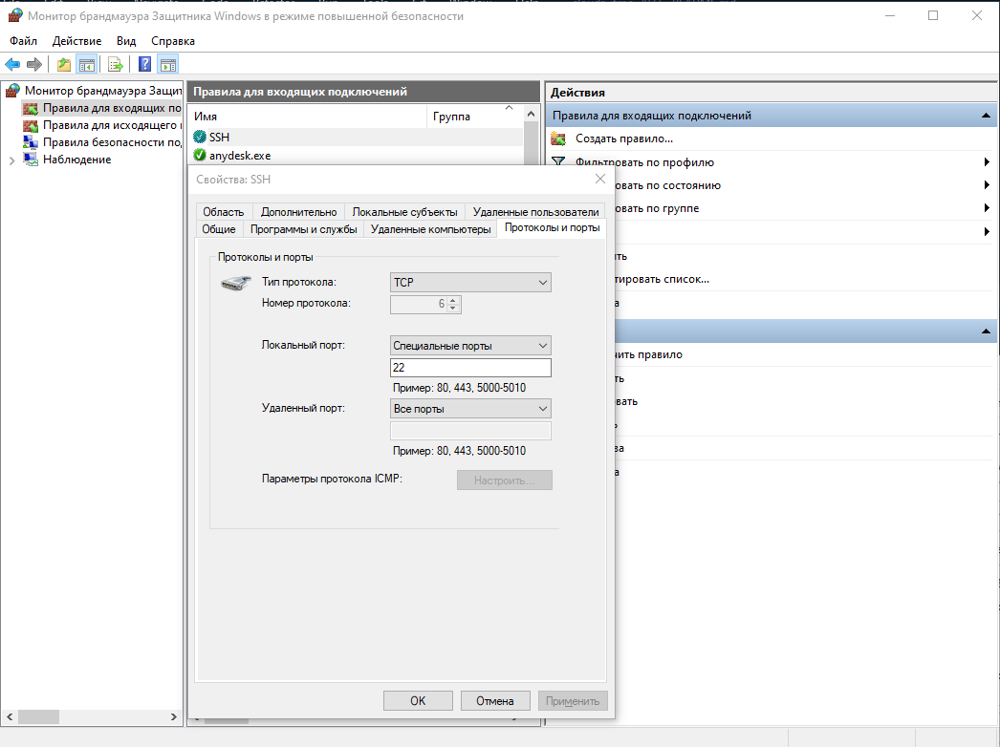
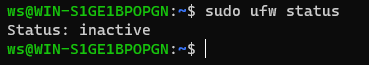
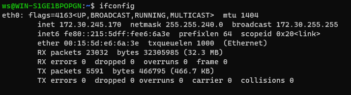
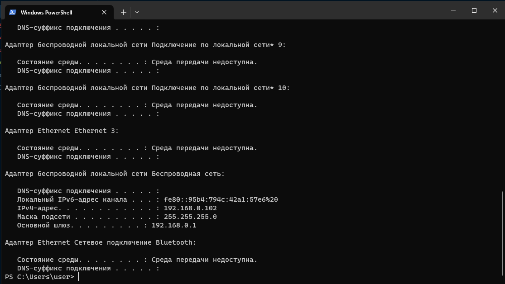

# Лабораторная работа №1
### Имеем:
- Компьютер 1 (на Windows 10 с WSL)
- Компьютер 2 (на Windows 10 с WSL)
- Компьютер 3 (на MacOS)
## Шаг 1. Произвели начальную настройку компьютеров
### На компьютерах 1 и 2:
1) В брандмауэере Windows разрешили входящие соединения по 22 порту

2) Установили OpenSSH-server командой: `sudo apt install openssh-server`
3) Раскомментировали в файле `/etc/ssh/sshd_config` строчку `PasswordAuthentication yes` для того, чтобы было возможно подключиться по SSH при помощи пароля от linux юзера. 
4) Проверили что брандмауэр в WSL отключен, командой: `sudo ufw status`  

5) Узнали локальный IP в WSL командой: `ifconfig`, запомним его как `wsl_local_ip`  

6) Установили проксирование соединений на 22 порт с Windows внутрь WSL, командой:  
<code>netsh interface portproxy add v4tov4 listenport=22 listenaddress=0.0.0.0 connectport=22 connectaddress={wsl_local_ip}</code>  
> В `connectaddress` указываем полученный на предыдущем шаге локальный IP в WSL
7) Узнали локальный IP компьютера уже в самой системе Windows, командой: `ipconfig`. Запомним его как `pc{n}_local_ip`

## Шаг 2. Перенесли файл с компьютера 1 на компьютер 2 при помощи компьютера 3.
1) Для этого создадим файл `test.txt` внутри WSL на компьютере 1, командой: `touch test.txt`
2) Перенесем этот файл командой:  
<code> scp ws@{pc1_local_ip}:/home/ws/test.txt billy@{pc2_local_ip}:/home/billy</code>