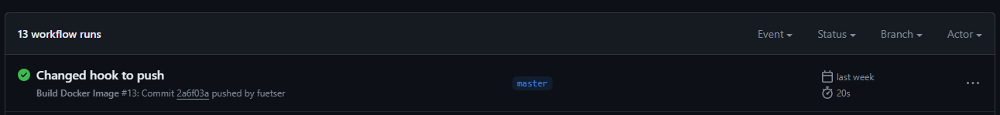
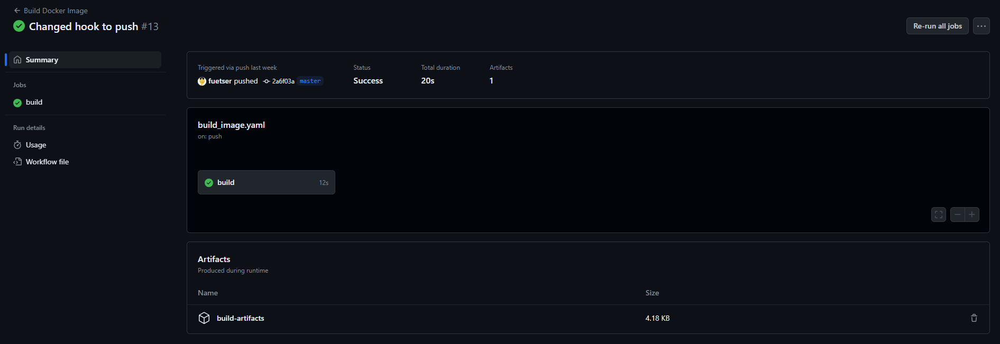
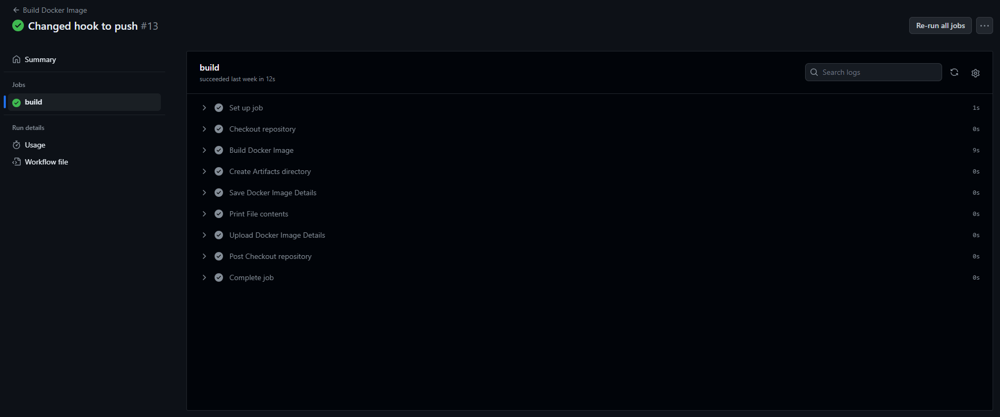

## Лабораторная работа №3

> Сделать, чтобы после пуша в ваш репозиторий автоматически собирался докер образ и результат его сборки сохранялся куда-нибудь. (например, если результат - текстовый файлик, он должен автоматически сохраниться на локальную машину, в ваш репозиторий или на ваш сервер).

### Код

```yaml
name: Build Docker Image

on: [push]
jobs:
  build:
    runs-on: ubuntu-22.04
    steps:
      - name: Checkout repository
        uses: actions/checkout@v4

      - name: Build Docker Image
        run: docker build -t clouds-lab3-app:latest -f $GITHUB_WORKSPACE/lab2/Dockerfile.good lab2
        
      - name: Create Artifacts directory
        run: mkdir artifacts

      - name: Save Docker Image Details
        run: docker inspect clouds-lab3-app:latest > artifacts/docker_image_details.json
      
      - name: Print File contents
        run: cat artifacts/docker_image_details.json

      - name: Upload Docker Image Details
        uses: actions/upload-artifact@v3
        with:
          name: build-artifacts
          path: artifacts/docker_image_details.json
      
```

### Шаги

1. Пайплайн запускается при пуше в репозиторий
    ```yaml
    on: [push]
    ```
2. Пайплайн состоит из одной джобы с названием *build*
    ```yaml
    jobs:
        build:
    ```
3. Пайплайн выполняется на виртуальной машине с ОС *ubuntu-22.04*
    ```yaml
    runs-on: ubuntu-22.04
    ```
4. Check-out репозитория в директорию *$GITHUB_WORKSPACE*
    ```yaml
    - name: Checkout repository
      uses: actions/checkout@v4
    ```
5. Сборка [docker образа](https://github.com/myown-del/clouds_itmo_2023/blob/master/lab2/Dockerfile.good) из лабораторной работы №2
    ```yaml
    - name: Build Docker Image
      run: docker build -t clouds-lab3-app:latest -f $GITHUB_WORKSPACE/lab2/Dockerfile.good lab2
    ```
6. Создание папки для хранения артефактов сборки
    ```yaml
    - name: Create Artifacts directory
      run: mkdir artifacts
    ```
7. Сохранение результата сборки docker образа в файл
    ```yaml
    - name: Save Docker Image Details
      run: docker inspect clouds-lab3-app:latest > artifacts/docker_image_details.json
    ```
8. Вывод содержимого файла в консоль
    ```yaml
    - name: Print File contents
      run: cat artifacts/docker_image_details.json
    ```
9. Прикрепление артефакта к сборке
    ```yaml
    - name: Upload Docker Image Details
      uses: actions/upload-artifact@v3
      with:
        name: build-artifacts
        path: artifacts/docker_image_details.json
    ```

Запуск пайплайна


Артифакт сборки


Выполнение шагов

